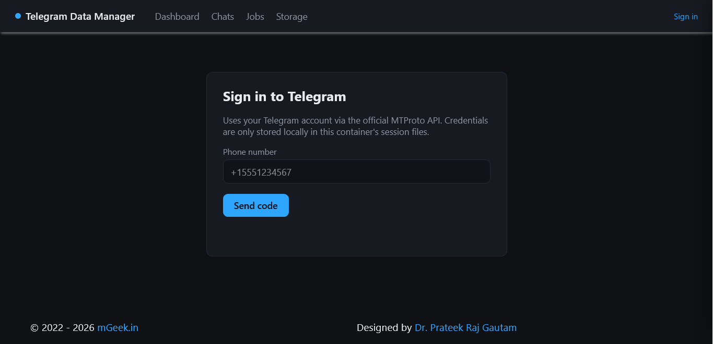
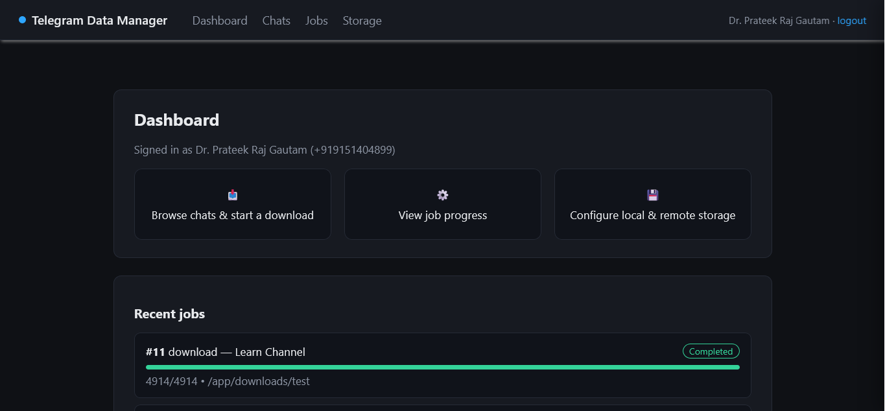
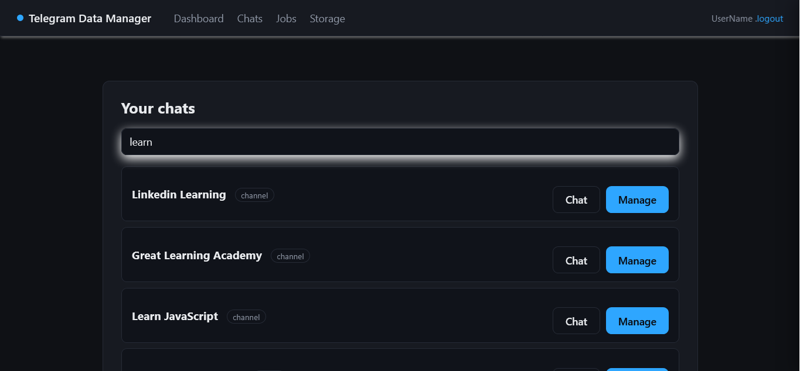
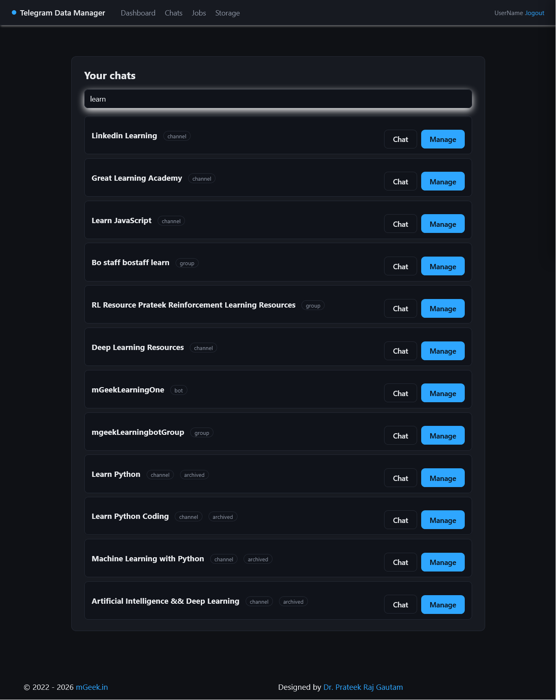
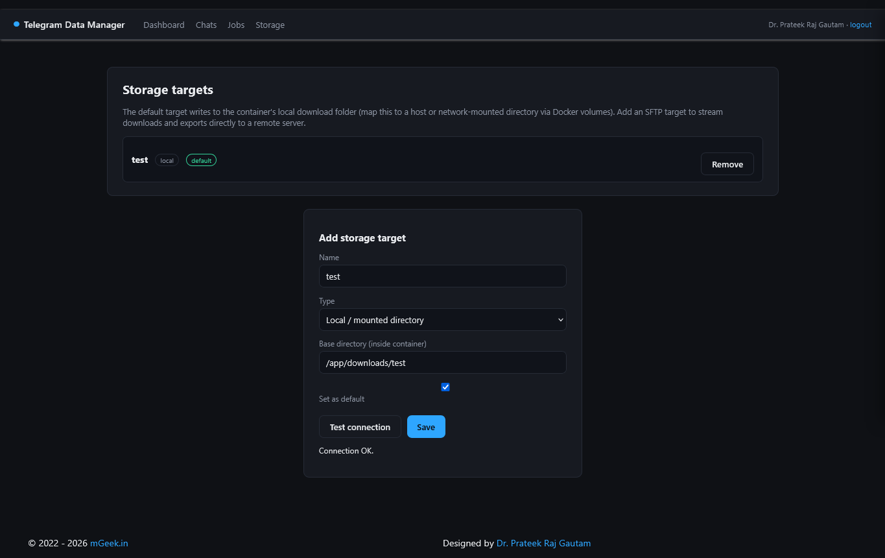
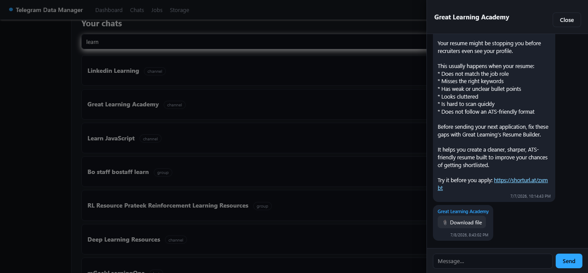
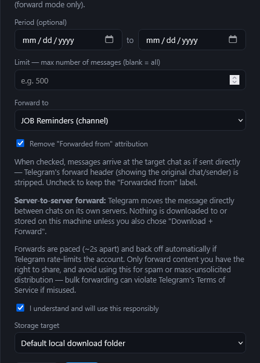
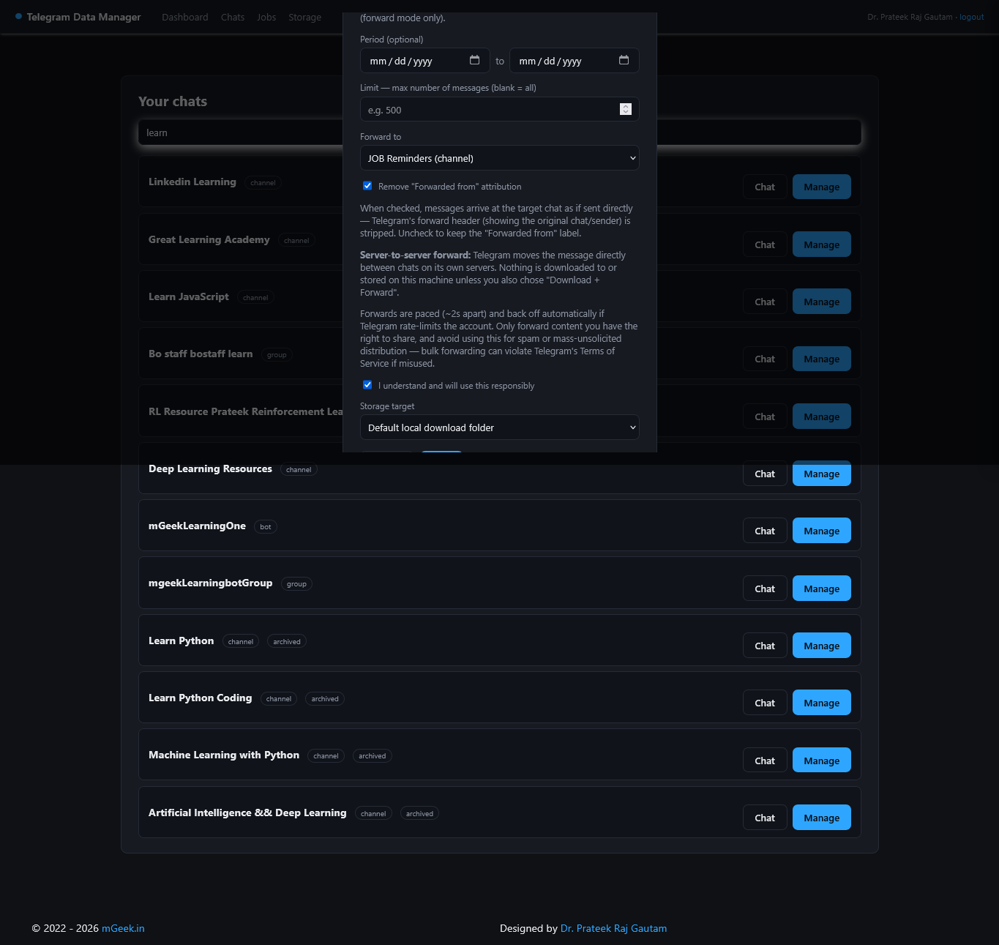
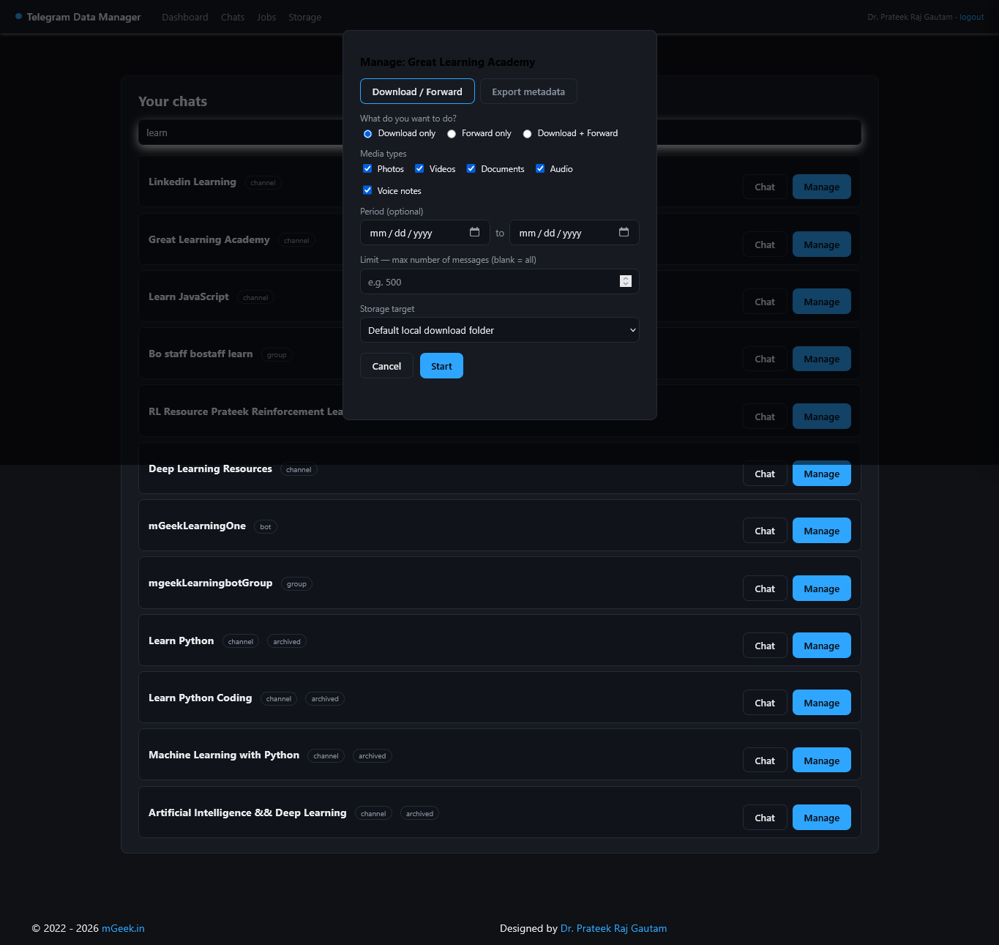

# Telegram Data Manager (TDM) — Web Edition

A FastAPI web application for backing up, browsing, and exporting your Telegram data, built on Telethon. This is the containerized, browser-based rewrite of the TDM CLI — sign in from a web UI, browse your chats, and kick off download/export jobs that can save directly to a local/mounted directory or stream straight to a remote server over SFTP.

## Project layout

```
telegram-data-manager/
├── src/app/
│   ├── main.py            # FastAPI app, page routes, startup/lifespan
│   ├── config.py          # Settings (env vars)
│   ├── database.py        # SQLAlchemy models (Account, Job, MediaItem, StorageTarget)
│   ├── telegram_client.py # Telethon login flow + session management
│   ├── downloader.py      # Media download engine
│   ├── exporter.py        # Metadata export (JSON/CSV/HTML)
│   ├── verify.py          # Checksum verification
│   ├── storage.py         # Local + SFTP storage backends
│   ├── jobs.py            # Async job queue/worker
│   ├── schemas.py         # Pydantic request/response models
│   ├── routers/           # API routes: auth, dialogs, jobs, settings
│   ├── templates/         # Jinja2 HTML pages
│   └── static/            # CSS/JS
├── Dockerfile
├── docker-compose.yml         # run the published Docker Hub image
├── docker-compose-build.yml   # build locally from source
├── .env.example
├── dockerhubreadme.md
└── pyproject.toml / requirements.txt
```

## Run locally (no Docker)

```bash
python -m venv .venv && source .venv/bin/activate
pip install -r requirements.txt
cp .env.example .env   # fill in TELEGRAM_API_ID / TELEGRAM_API_HASH
export PYTHONPATH=src
python -m uvicorn app.main:app --reload
```

Open http://localhost:8000.

## Run with Docker

```bash
cp .env.example .env   # fill in credentials
docker compose up -d              # pulls prateekrajgautam/telegram-data-manager
# or build locally instead of pulling:
docker compose -f docker-compose-build.yml up -d --build
```

## Build & publish to Docker Hub

```bash
docker build -t prateekrajgautam/telegram-data-manager:latest .
docker login
docker push prateekrajgautam/telegram-data-manager:latest
```

## Architecture notes

- **Single-worker job engine by default** (`MAX_CONCURRENT_DOWNLOADS=1`) — schema and engine were designed single-worker first, per project convention, with concurrency as an opt-in scale-up.
- **Storage abstraction** (`storage.py`) lets download/export jobs stream bytes directly to either a local path (map to any host/network-mounted directory via Docker volumes) or a remote SFTP server, with no temp-file intermediate.
- **Session persistence**: Telethon `.session` files live under `/app/data/sessions`, chmod 600 by convention — mount `/app/data` to a private volume and back it up like a secret.
- Forwarding/filter engine from the original CLI project is not yet ported to the web edition; the current focus is browse → download/export → verify.


# UI











## License / ToS

For personal backups of data you already have access to. Respect [Telegram's Terms of Service](https://telegram.org/tos).
